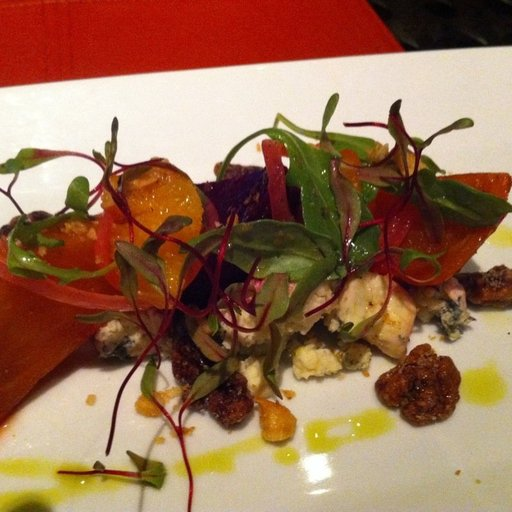

# Food Interpolator
Deep Generative Models Course Project at TU Darmstadt.

## Goal
The main goal of this project is to learn a conditional GAN that can interpolate between different types of food. 
We want to achieve fluid transitions between e.g.:
- Pancakes -> Pizza
- ...

## Dataset
We use the Food-101 dataset from [Bossard et al. ](https://www.vision.ee.ethz.ch/datasets_extra/food-101/):

  ```
We introduce a challenging data set of 101 food categories, with 101000 images. For each class, 
250 manually reviewed test images are provided as well as 750 training images. On purpose, the 
training images were not cleaned, and thus still contain some amount of noise. This comes mostly
in the form of intense colors and sometimes wrong labels. All images were rescaled to have a 
maximum side length of 512 pixels. 
  ```

The dataset contains a number of different subsets of the full food-101 data. The idea is to make a more exciting simple training set for image analysis than CIFAR10 or MNIST. For this reason the data includes massively downscaled versions of the images to enable quick tests. The data has been reformatted as HDF5 and specifically Keras HDF5Matrix which allows them to be easily read in. The file names indicate the contents of the file.

### Samples
 

 
 

## Code Base
Our code is based on a [PyTorch implementation](https://github.com/jalola/improved-wgan-pytorch) of [Improved Training of Wasserstein GAN](https://arxiv.org/abs/1704.00028).
