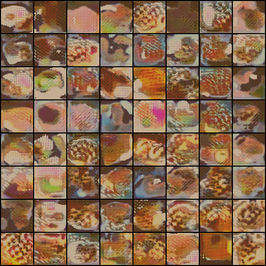

# Milestones

## 25.07
### Overfitting Results
  - Trained WGAN-GP (with Auxillary Classifier) on the following images:
    -      
  - Results:
    - 
  - Metrics:
    - 
    - 
    - 

### First run with all samples from Pizza and Pancakes
- Generated images
  - 
- Metrics:
  - 
  - 
  - 

### Dataset Switch
- The image quality of samples from Food 101 might not be good enough:
  - only 1k samples per class
  - bad lightening
  - different angles
  - differen scales
  - includes many other (non-food) objects 
  - Comparison:
    - Burger data: Google (left) vs Food 101 (right)

    - Pizza data: Google (left) vs Food 101 (right)

- => Create our own dataset from google
  - use [Google Images Download](https://github.com/hardikvasa/google-images-download)
  - Start with two classes (pizza, burger)
  - download > 10k images per class

## 18.06
- **Basic Model Implementation**
  - We have chosen *PyTorch* as the deep learning framework since its dynamic computation graph and eager evaluation allows us to quickly protoype and debug our experiments
  - As base implementation, we will use a [PyTorch implementation](https://github.com/jalola/improved-wgan-pytorch) of WGAN-GP

- **Next Goals**
  - Train first model on Food-101 dataset
  - Save training weights
  - Visualize generated images
  - Come up with an idea for conditional interpolation between classes

## 11.06 
- **Main goal definition**: 
  - Generate conditioned images of food  
  - Interpolate between different classes of food using the labels as condition

- **Model**:
  - We wil use WGAN-GP proposed in [Improved Training of Wasserstein GAN](https://arxiv.org/abs/1704.00028)

- **Dataset**:
  - We have chosen the Food 101 dataset by [Bossard et al. ](https://www.vision.ee.ethz.ch/datasets_extra/food-101/)
  - Contains 101 different classes of food, each represented by 1000 images
  - *Samples*
    -      

- **Next Goals**
  - Decide for Deep Learning framework
  - Find a robust base implementation of [Improved Training of Wasserstein GAN](https://arxiv.org/abs/1704.00028) in that framework

